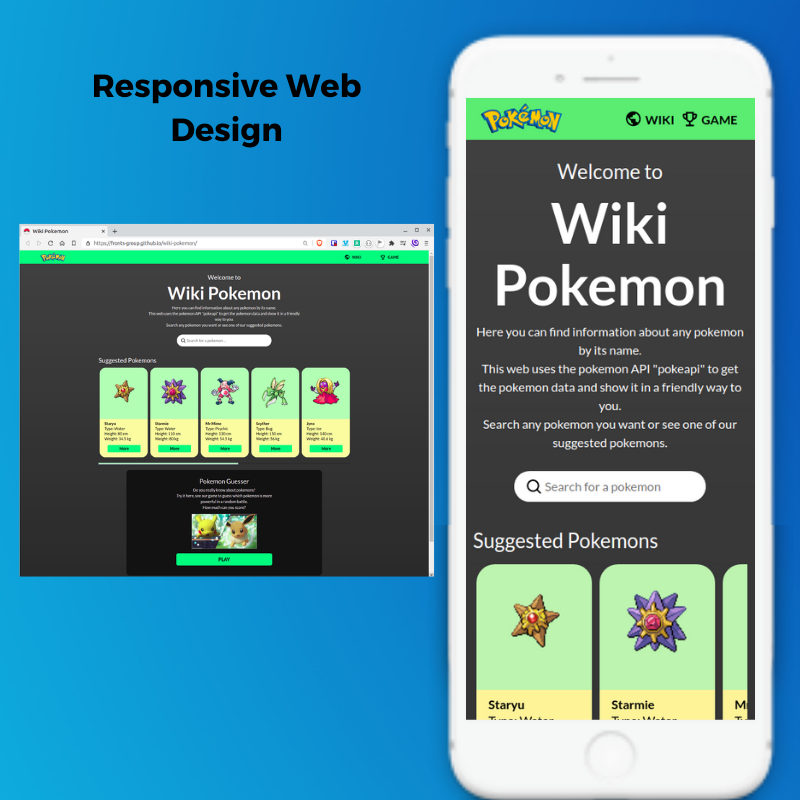

# Wiki Pokemon

Wiki Pokemon is a web app to check some information about your favorite pokemons. The user can search any pokemon by its name or their number in the pokedex. We get the pokemon information from [PokeAPI](https://pokeapi.co/). Beside the pokemon search, the user is able to prove his knowledge in pokemons with a game to guess which pokemon in a battle has a greater stats between the available stats in the PokeAPI.

To see the web page [click here](https://fronts-group.github.io/wiki-pokemon/)

Wiki Pokemon es una aplicación web para revisar información sobre tus pokemons favoritos. El usuario puede buscar cualquier pokemon por su nombre o su número en la pokedex. Obtenemos la información de Pokémon de [PokeAPI](https://pokeapi.co/). Además de la búsqueda de pokemons, el usuario puede demostrar sus conocimientos en pokemons con un juego para adivinar qué pokemon tiene mejores estadísticas en una batalla entre las estadísticas disponibles en la PokeAPI.

Para ver la página web haz [click aqui](https://fronts-group.github.io/wiki-pokemon/)

## Diseño de Interfaz de Usuario

### Usuario y objetivo

El usuario principal de la web app es una persona interesada en conocer información y estadísticas de un pokemon o  diferentes pokemons. Además, es una persona que le gustaría probar sus conocimientos o que busca divertirse con un juego sencillo con temática Pokemon.

### Solución para el usuario

La web app permite al usuario buscar cualquier pokemon registrado en la PokeAPI.
Despliega la información del pokemon en la página "Wiki" como los movimientos, el peso, la estatura, y las gráficas de sus habilidades. Además tiene sugerencias de pokemons similares a su búsqueda para conocer su información.

Por otra parte, en la web app se puede iniciar un juego sencillo en el que se comparan dos pokemons. El usuario debe seleccionar que pokemon tiene una de sus estadísticas más altas de acuerdo a la pregunta que sale en pantalla. Las estadísticas que se comparan son las que estan disponibles en la pokeAPI. Si el usuario acierta el puntaje en la pantalla aumenta, si falla el puntaje se mantiene. A continuación, aparecen nuevos pokemons se selecciona una estadística aleatoria para que el usuario adivine nuevamente.

### Ideas Iniciales del Diseño

En el diseño ideal, decidimos utilizar un header en todas las páginas con el logo de Pokemon y con dos opciones en un menú de navegación para ir a la página principal o a la página del juego.

En la página principal buscamos implementar un campo de busqueda y algunas sugerencias para que el usuario seleccione un pokemon.

En la página de información de pokemon o "wiki" mostrabamos la imagen del pokemon, información en téxto, una tabla con algunas estadísticas, dos o tres gráficas y más sugerencias de pokemon similares.

En la página de juegos buscamos que la posición de las imágenes de los pokemon sean similares a la posición que tienen en batallas. Además tiene dos botones para seleccionar cual de los pokemons seleccionará el usuario, una línea para mostrar la puntuación y otra línea para desplegar las instrucciones del juego.

A continuación se ven los bocetos realizados para el diseño de las pantallas.

### Prototipo de Alta Fidelidad
El prototipo se realizó en Figma, [click aquí para verlo.](https://www.figma.com/file/VgGs1K4E12NQvSA9w4Z94H/PokeWiki?node-id=0%3A1)

### Previsualizacion de Pantallas

## Consideraciones técnicas sobre el proyecto
- El buscador realiza las consultas a la API y obtiene la información solo si los nombres están escritos correctamente.
- La página muestra la información de los pokemones según la BDD de [PokeAPI](https://pokeapi.co/).

## Tecnologías Utilizadas

Para el proyecto se utilizó las siguientes tecnologías:

* HTML 5
* CSS 3
* JavaScript

## Instalación del Proyecto en Local

1. Clona o descarga el repositorio en tu equipo.
2. Ingresa al directiorio del repositorio por terminal.
3. Instala las dependencias del proyecto utilizando NodeJS con el comando `npm install`.
4. Inicia un servidor local del proyecto con el comando `npm start`.
5. Ingresa en tu navegador a la dirección `http://localhost:5000`.

Este proyecto es parte de la ruta del bootcamp de [Laboratoria - Frontend Developer](https://www.laboratoria.la/) del año 2020. Estamos realizando sus proyectos de forma autodidacta e independiente.

  <h3>
    <a href="https://fronts-group.github.io/wiki-pokemon/">
      Página Web
    </a>
     | 
    <a href="https://github.com/Laboratoria/BOG002-data-lovers">
      Instrucciones
    </a>
  </h3>

